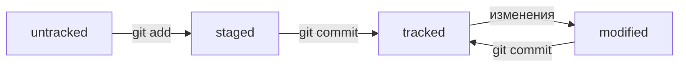

# Git

**Git** -- это система контроля версий:  

- позволяет хранить историю изменений
- помогает синхронизировать изменения, сделанные разными участниками команды
- позволяет хранить несколько версий проекта
- изменения хранятся в коммитах
- идентификатором коммита выступает его SHA-1 хеш
- последовательности коммитов образуют ветки
- может существовать несколько веток
- основная ветка называется master или main
- ветки могут объединяться
- вся служебная информация хранится в папке .git
- файл HEAD хранит ссылку на служебный файл в котором записан хеш последнего коммита
- статусы файлов:
- * ```untracked``` - изменения не отслеживаются
- * ```staged (+ tracked)``` - изменения подготовлены к коммиту
- * ```modified (+ tracked)``` - изменения в отслеживаемом файле, не подготовленые к коммиту
- * ```tracked``` - файл отслеживается (не выводится в ```git status```)
- * файл может быть одновременно ```staged``` и ```modified```, но это будут разные его версии



[Официальная страница загрузки](https://git-scm.com/download/)

---

**Git** имеет интерфейс командной строки, для работы с которым полезно знать основные команды для работы с файлами:  
- ```pwd``` - вывести текущий каталог
- ```ls -a <dir>``` - вывести список всех папок и файлов в каталоге _dir_
- ```cd <dir>``` - сменить текущий каталог на _dir_
- ```~``` - домашний, ```.``` - текущий, ```..``` - родительский, ```/``` - корневой каталоги
- ```mkdir <dir1> <dir2> ...``` - создать каталоги _dir1, dir2, ..._
- ```mkdir -p <dir>``` - создать каталог _dir_ и весь путь до него (если уже есть, ошибки не возникнет)
- ```touch <file1> <file2> ...``` - создать файлы _file1, file2, ..._
- ```rm <file1> <file2> ...``` - удалить файлы _file1, file2, ..._
- ```rmdir <dir1> <dir2> ...``` - удалить пустые каталоги _dir1, dir2, ..._
- ```rm -r <dir1> <dir2> ...``` - удалить рекурсивно каталоги _dir1, dir2, ..._
- ```cp <file1> <file2> ... <dir>``` - копировать файлы _file1, file2, ..._ в каталог _dir_
- ```mv <file1> <file2> ... <dir>``` - переместить файлы _file1, file2, ..._ в каталог _dir_
- ```cat <file1> <file2> ...``` - сконкатенировать и вывести содержимое файлов _file1, file2, ..._
- ```&&``` - для выполнения нескольких команд сразу
- Стрелки вверх и вниз - перемещение по историии команд
- Tab - дополнение названий команд и файлов папок по первым символам
- ```HEAD``` - синоним хеша последнего коммита

---

## Команды для работы с Git

- ```git version``` - проверка версии Git
- ```git config --global user.name "John Smith"``` - задать имя пользователя в глобальных настройках Git
- ```git config --global user.email "john@server.com"``` - задать e-mail пользователя в глобальных настройках Git
- ```git config user.name "John Smith"``` - задать имя пользователя в настройках репозитория в рабочем каталоге
- ```git config user.email "john@server.com"``` - задать e-mail пользователя в настройках репозитория в рабочем каталоге
- ```cat ~/.gitconfig``` - вывести содержимое файла с глобальными настройками Git
- ```git config --list``` - вывести настройки git (результат зависит от текущего каталога, к глобальным настройкам git добавляются настройки репозитория из текущего каталога)
- ```git init``` - сделать рабочий каталог репозиторием (внутри рабочего каталога будет создан подкаталог .git в котором будет храниться вся служебная информация)
- ```rm -rf .git``` - "разгитить" рабочий каталог
- ```git clone git@github.com:YandexPraktikum/first-project.git``` - склонировать репозиторий с указанным URL на локальный компьютер
- ```git status``` - проверить статус репозитроия
- ```git add <file1> <file2>``` - добавить файлы _file1, file2_ к подготавливаемому коммиту
- ```git add -all``` - добавить все изменения к подготавливаемому коммиту
- ```git add .``` - добавить всю текущую папку к подготавливаемому коммиту
- ```git commit -m "Комментарий к коммиту"``` - сделать коммит подготовленных (staged) изменений с сопутствующим комментарием
- ```git commit --amend --no-edit``` - добавить ```staged``` изменения к последнему коммиту без изменения сообщения
- ```git commit --amend -m "Новое сообщение"``` - добавить ```staged``` изменения к последнему коммиту и изменить сообщение
- ```git log``` - просмотреть историю коммитов
- ```git log --oneline``` - просмотреть список коммитов в формает сокр. хеш + комментарий к коммиту
- ```git remote add origin git@github.com:%ИМЯ_АККАУНТА%/%НАЗВАНИЕ ПРОЕКТА%.git``` - привязать к локальному удалённый репозиторий с указанным URL под именем origin
- ```git remote -v``` - убедиться, что локальный репозиторий связан с удалённым
- ```git remote rm origin``` - удалить текущий origin
- ```git push -u origin my-branch``` - отправить новую ветку ```my-branch``` в удалённый репозиторий и связать локальную ветку с удалённой, чтобы при дополнительных коммитах можно было писать просто ```git push``` без ```-u```
- ```git push``` - последующие отправки изменений в текущей ветке
- ```git push origin my-branch``` — отправить дополнительные изменения в ветку ```my-branch```, которая уже существует в удалённом репозитории
- ```git status``` - показать текущее состояние репозитория
- ```git status --ignored``` - показать текущее состояние репозитория и игнорируемые файлы/папки
- ```git restore --staged hello.txt``` - перевести файл hello.txt из ```staged``` обратно в ```untracked``` или ```modified```
- ```git restore hello.txt``` - вернуть файл hello.txt к последней версии, которая была сохранена через ```git commit``` или ```git add```
- ```git reset --hard b576d89``` — откатиться до указанного коммита (последующие коммиты будут утеряны)
- ```git diff``` — показать изменения в «рабочей зоне», то есть в ```modified```-файлах
- ```git diff a9928ab 11bada1``` — вывести разницу между двумя коммитами
- ```git diff <название_ветки_1> <название_ветки_2>``` — вывести разницу между двумя ветками
- ```git diff HEAD~3 HEAD~1``` — ```~N``` — N коммитов назад от указанного (может применяться к навзваниям веток, HEAD, или хешам коммитов)
- ```git diff --staged``` — показать изменения, которые добавлены в ```staged```-файлах
- ```git branch``` — посмотреть, какие в проекте есть ветки и какая является текущей
- ```git branch -a``` — посмотреть все ветки, и локальные и удалённые
- ```git branch <название_новой_ветки>``` — создать новую ветку
- ```git checkout <название_ветки>``` — переключиться на указанную ветку
- ```git checkout -b <название_ветки>``` — создать указанную ветку и переключиться на неё
- ```git merge <название_ветки>``` — выполнить слияние веток. Выполняется из ветки, куда должны добавиться изменения
- ```git branch -D <название_ветки>``` — удалить ветку даже если она не была смёрджена (Удаление локальной ветки через Git не удаляет ветку на GitHub!)
- ```git branch -d <название_ветки>``` — удалить ветку только если она была смёрджена
- ```git pull``` — вытянуть изменения текущей ветки из удаленного репозитория в локальный
---

# GitHub

[**GitHub**](https://github.com) - самый популярный сервис для размещения удалённых репозиториев  
Для удобства работы с удалённым репозиторием можно использовать SSH.  
Создать пару публичный/приватный ключ можно командой  
```
$ cd ~ # перешли в домашнюю директорию
$ ls -la .ssh/ # вывели список созданных ключей, если ничего нет
$ ssh-keygen -t ed25519 -C "электронная почта, к которой привязан ваш аккаунт на GitHub" # создаём пару ключей
$ ssh-keygen -t rsa -b 4096 -C "электронная почта, к которой привязан ваш аккаунт на GitHub" # или так
```
после чего содердимое ```pub-файла``` надо загрузить в _GitHub->Settings->SSH and GPG keys->New SSH key_  
Проверить работоспособность SSH можно командой ```$ ssh -T git@github.com```

---

## README.md

Файл ```README.md``` в корне репозитория предназначен для описания проекта и использует язык разметки **markdown**  
[Гайд по markdown](https://www.markdownguide.org/cheat-sheet/)  
[Шпаргалка на GitHub](https://gist.github.com/fomvasss/8dd8cd7f88c67a4e3727f9d39224a84c)

# Header 1
## Header 2
### Header 3
#### Header 4
##### Header 5
###### Header 6

text<br>above<br>line

---

text  
below  
line

12345
67890

*italic* _text_  
**bold** __text__  
~~strikeout text~~

1. numerated
2. list

* unordered
* list

---

- one more
- unordered list

[Yandex link](https://www.yandex.ru "I'm Yandex!")

```bash
cd ~
ls -la
```

```html
<h1>HTML Header 1</h1>
```


---

## Комментарии к коммитам
- Корпоративный с Jira-ID: ```LGS-239: Дополнить список пасхалок новыми числами```
- Conventional Commits: ```feat: добавить подсчёт суммы заказов за неделю```
- GitHub-стиль с номером задачи: ```Исправить #334, добавить график температуры```
